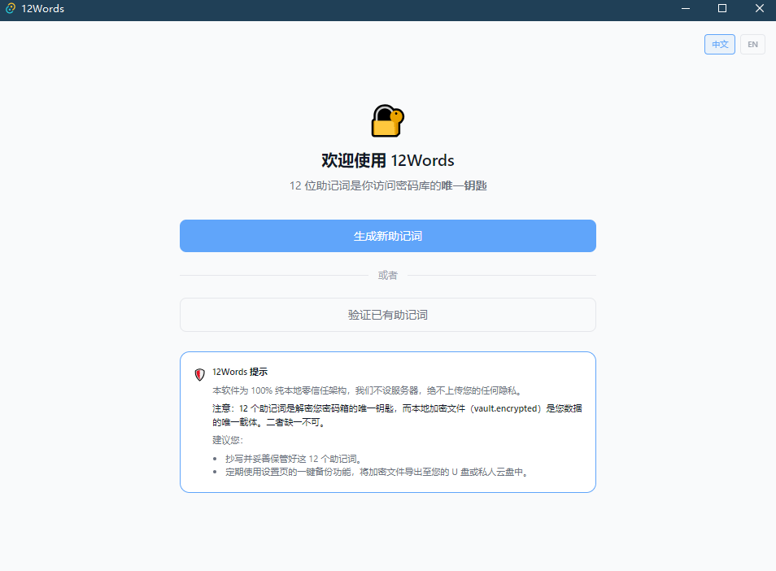
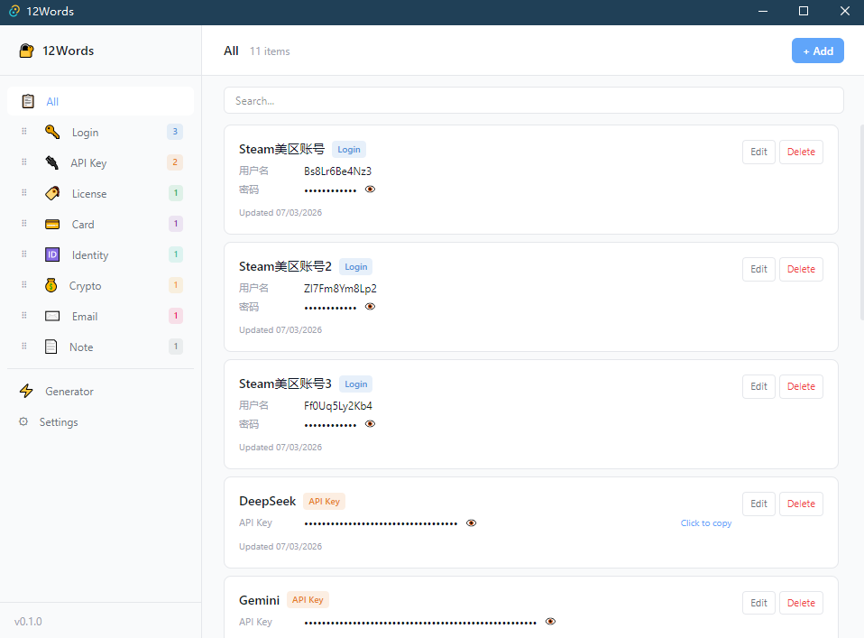
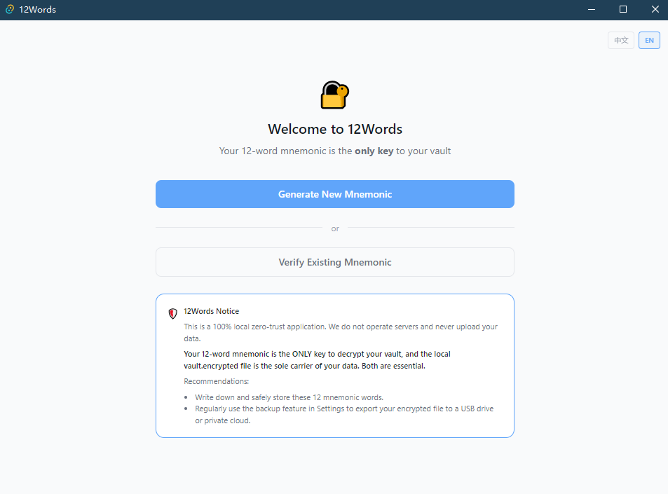

# 🔐 12Words - 去中心化极简安全保险箱 / Decentralized & Secure Vault

[English](#english) | [中文](#中文)

---

## 中文

`12Words` 是一款专为极客、Web3 爱好者及隐私至上者打造的**纯本地、零信任、去中心化**的数字资产与密码安全保险箱。我们坚信：**您的身家性命，不应托付给任何人的服务器。**

### 📸 软件截图

### ✨ 核心特性
*   **🔑 助记词主锁：** 引入 Web3 级别的 12 个助记词（BIP39 算法）作为唯一的身份凭证与解密钥匙。告别传统易被暴力破解的弱密码。
*   **🛡️ 绝对零信任（Zero-Knowledge）：** 100% 纯本地运行，不联网、无服务器。使用商业级 `AES-256-GCM` 算法对数据进行底层加密。
*   **📂 全品类资产结构化管理：** 完美适配账号密码、API 密钥（如 DeepSeek/OpenAI）、软件卡密、银行卡、加密钱包私钥、敏感证件以及加密便签。
*   **⚡ 内置随机密码生成器：** 纯本地一键生成 4-128 位高强度随机密码，支持数字、符号自定义组合。
*   **🔒 剪贴板保护：** 密码复制后 20 秒自动从系统剪贴板物理清除，防止后台恶意软件窃取隐私。
*   **💾 100% 掌控的冷备份：** 支持一键导出/导入加密库（`vault.encrypted`），通过 U 盘或个人网盘实现绝对安全的跨设备数据迁移。

### 🚀 快速开始
1. 前往本仓库的 [Releases](https://github.com/xw321k/12words/releases) 页面，下载最新的 Windows 安装包：`12Words_0.1.0_x64_en-US.msi`。
2. 双击安装并打开软件，生成属于你的 12 个助记词（**请务必物理抄写备份！**）。
3. 开始安全地存放你的数字资产。

## 🤝 欢迎贡献 / Contributing

本项目完全开源，目前仍处于早期阶段。如果你有任何想法、发现了 Bug、或者想为 `12Words` 增加新功能（例如：更多本地小工具、跨平台适配等），非常欢迎提交 **Issue** 或直接发起 **Pull Request (PR)**！让我们一起把这个纯本地的数字资产保险箱变得更完美。

---

## English

`12Words` is a **100% local, zero-knowledge, and decentralized** digital asset and password vault built for geeks, Web3 enthusiasts, and privacy purists. We believe that **your most sensitive data should never be trusted to anyone else's server.**

### 📸 Screenshots

### ✨ Key Features
*   **🔑 Mnemonic Master Lock:** Uses Web3-standard 12-word seed phrases (BIP39) as the sole identity credential and decryption key. Say goodbye to easily brute-forced traditional passwords.
*   **🛡️ Absolute Zero-Knowledge:** Operates entirely offline with zero network requests. All data is locked using industry-standard `AES-256-GCM` encryption locally.
*   **📂 Structured Asset Categories:** Tailored for Accounts/Passwords, API Keys (e.g., DeepSeek/OpenAI), License Keys, Credit Cards, Crypto Wallet Private Keys, Secure Identities, and Encrypted Notes.
*   **⚡ Built-in Password Generator:** Instant local generation of high-strength random passwords (4-128 characters) with customizable numbers and symbols.
*   **🔒 Clipboard Protection:** Automatically clears copied passwords after 20 seconds to prevent background snooping.
*   **💾 Sovereign Cold Backup:** Export/import your encrypted vault (`vault.encrypted`) with one click to transfer data securely via USB or private drives.

### 🚀 Quick Start
1. Go to the [Releases](https://github.com/xw321k/12words/releases) page of this repository and download the latest Windows installer: `12Words_0.1.0_x64_en-US.msi`.
2. Run the installer, launch the application, and generate your unique 12 words (**Make sure to write them down on paper!**).
3. Start safeguarding your digital assets with absolute peace of mind.

---

## 🛠️ Tech Stack / 技术栈
*   **Backend:** Rust (Tauri)
*   **Frontend:** Vue 3, Vite, Tailwind CSS
*   **Encryption:** AES-256-GCM (Rust Crypto)

## 📄 License
This project is open-source under the [GPL-3.0 License](LICENSE).

Contributions are what make the open-source community such an amazing place to learn, inspire, and create. Any contributions you make are **greatly appreciated**:
1.  Fork the Project
2.  Create your Feature Branch (`git checkout -b feature/AmazingFeature`)
3.  Commit your Changes (`git commit -m 'Add some AmazingFeature'`)
4.  Push to the Branch (`git push origin feature/AmazingFeature`)
5.  Open a Pull Request
